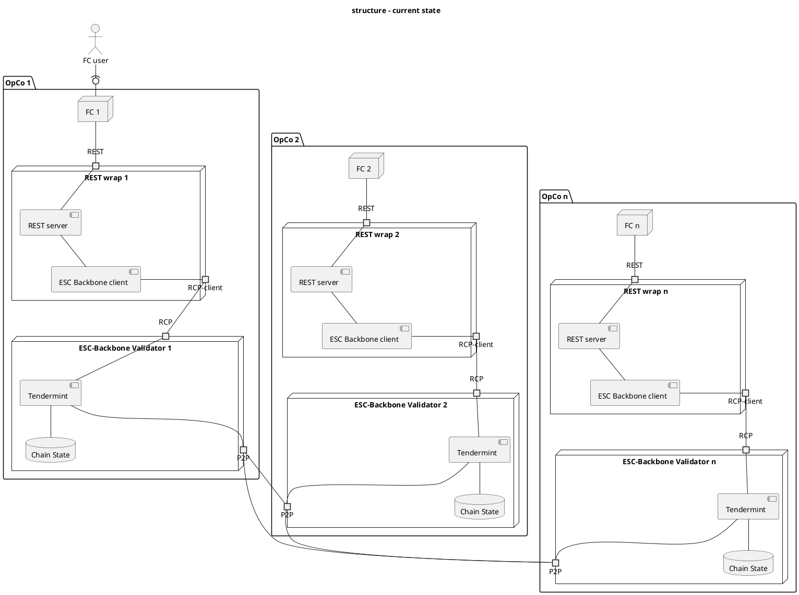
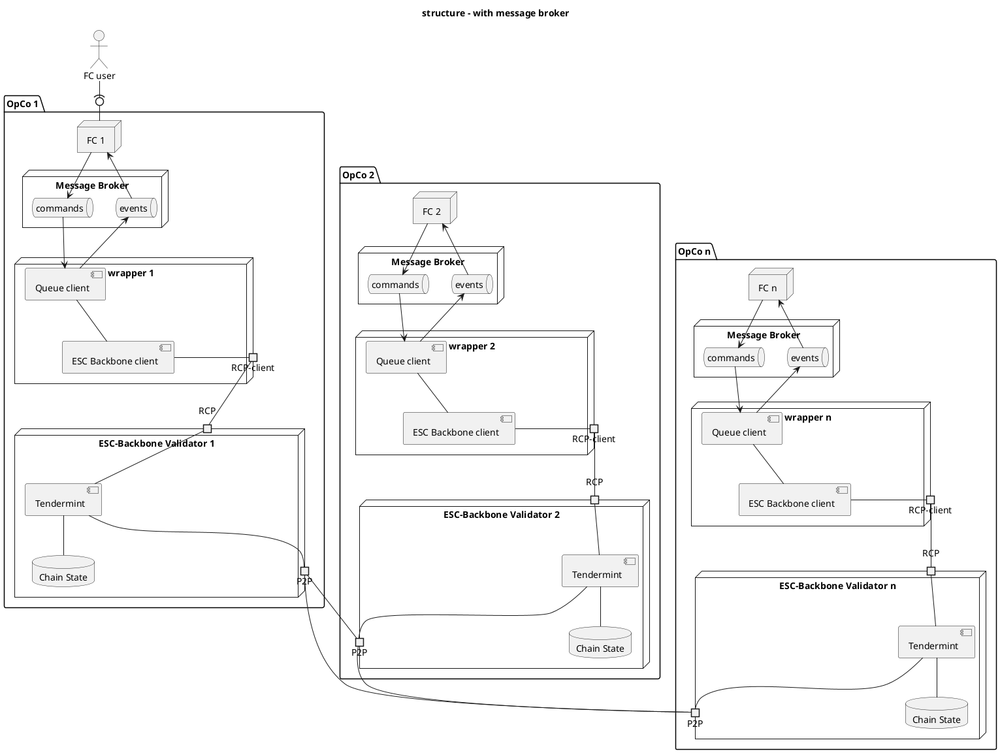
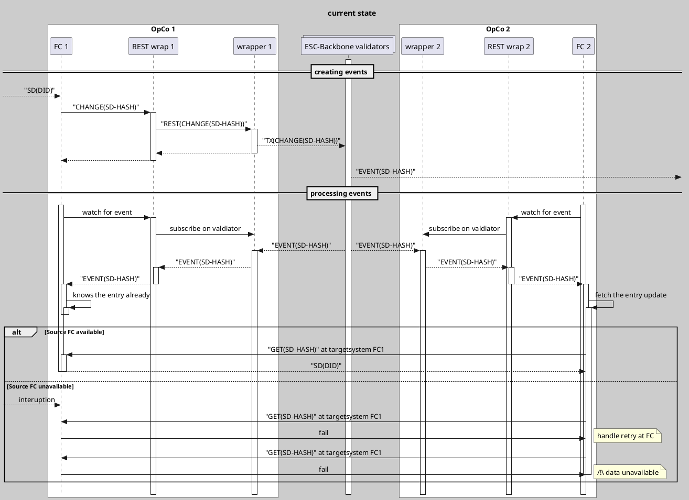
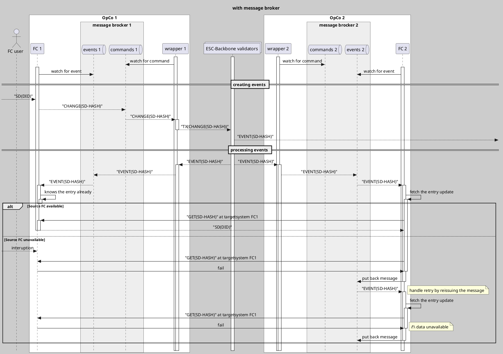

## Setup
```shell
W_HOME=wrapper-home
mkdir -p $W_HOME && cd $W_HOME
IMAGE_HASH=latest
docker run -it -e CONFIG=/wrapper/config/config.json -v $(pwd):/wrapper/config ghcr.io/catenax-ng/esc-res-sync-rest-wrapper:$IMAGE_HASH /bin/bash
cp default-config.json config/config.json
cd config/
echo "Create mnemonic, this is to be kept secret, from this the private key can be generated."
/wrapper/esc-backboned keys mnemonic --home $(pwd) > mnemonic
echo "Import private key with mnemonic as 'wrapper'"
cat mnemonic | /wrapper/esc-backboned keys add wrapper --keyring-backend test --home $(pwd) --recover
echo "Store public address for the faucet request."
/wrapper/esc-backboned keys show wrapper --home $(pwd) --keyring-backend test -a > pubaddr
exit
echo "Request funds at the test net."
DENOM=$(curl https://validator-webapp1-web-app.dev.demo.catena-x.net/chain/catenax-testnet-1-suggestion.json | jq ".feeCurrencies[0].coinMinimalDenom" -r)
curl -X POST --header "Content-Type: application/json" -d '{"address":"'$(cat pubaddr)'","denom":"'$DENOM'"}'  https://faucet-faucet.dev.demo.catena-x.net/
echo "Wait 10s and check the balance"
wait 10 && esc-backboned query bank balances --home $(pwd) --node https://validator2-tdmt-rpc.dev.demo.catena-x.net:443/  $(cat pubaddr)
echo "Start the wrapper"
docker run -p 7000:8080 -e CONFIG=/wrapper/config/config.json -v $(pwd):/wrapper/config ghcr.io/catenax-ng/esc-res-sync-rest-wrapper:$IMAGE_HASH
```

## Creating a resource
```shell
curl -X POST http://localhost:7000/resource -d '{"origResId":"localtest", "targetSystem":"http://localhost", "resourceKey":"my key" }'
```

## Generate openapi.json
```shell
docker run --rm -it  --user $(id -u):$(id -g) -e GOPATH=$(go env GOPATH) -v $HOME:$HOME -v $(go env GOCACHE):/.cache/go-build -w $(pwd) --entrypoint=/bin/sh quay.io/goswagger/swagger 
SWAGGER_GENERATE_EXTENSION=false swagger generate spec -m -c cmd/rest-wrapper/ -o cmd/rest-wrapper/openapi.json 
```

# Input
```
Hi Lars,
We’ve discussed the possible reliability issues with current synch solution:

- What should FC do when SD event happens, but Synch service is not available (it’s down or some network issue)
- What should Synch service do when it got SD event, but subscribed FC instance is not available (it’s down or some network issue)

To address them we’ll need a kind of reliable message broker solution supporting durable subscriptions. But then we’ll not need to communicate with Synch service via REST API at all.
Let’s agree on how will we resolve it.
```


# For discussion

## Structure




## Creating and processing change events

### current approach


### with message broker (not implemented)
same issus, if the `targetSystem` of the event is unavailable a sync is not possible.
