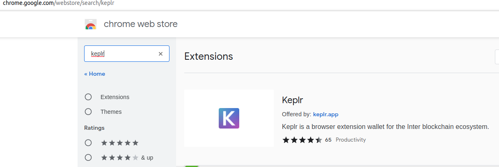
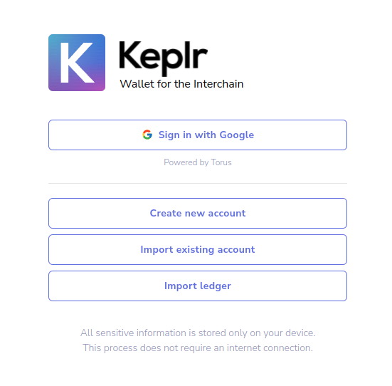
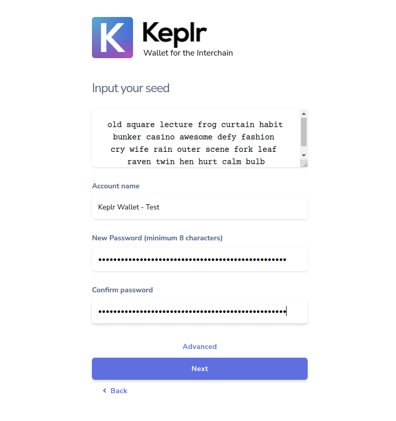
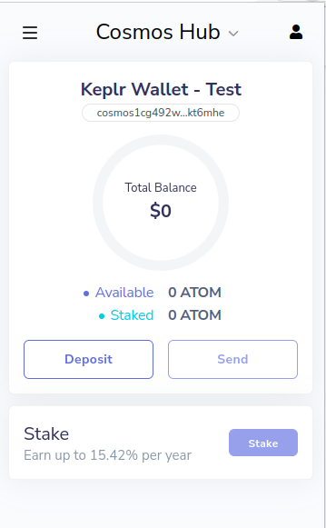
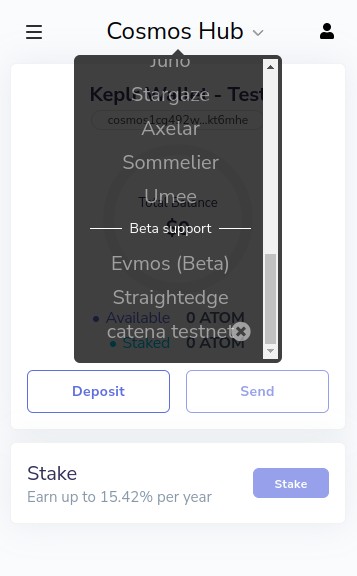
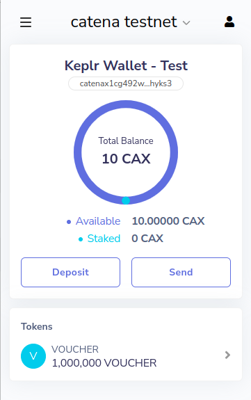

# Prerequisites
## Install starport
Follow  [these instructions](https://docs.starport.com/guide/install.html)

## Install Keplr extension
Install the [keplr extension](https://chrome.google.com/webstore/search/keplr) to chrome.


## Install nodejs with npm
Suggestion is to use [Node Version Manager](https://github.com/nvm-sh/nvm#installing-and-updating) for installing nodejs

# Serve the development chain
## Clone the repository
```shell
git clone git@github.com:catenax/esc-backbone.git
```
## Serve the development chain
```shell
cd esc-backbone && starport chain serve
```

## Serve the vue web app
Open a new terminal
```shell
cd esc-backbone/vue && npm install && npm run build && npm run serve
```


# Use the wallet browser extension.
## Import the example/ test wallet
Click at the Keplr extension  at the top right.


If there is no wallet configured you are taken to this page. Click on either on `Create new account` for a new account 
or on `Import existing account` to import an account with mnemonic.


**NOTE: The password entered at the next page is used to secure the Keplr walled entirely and not just the account. 
All later added accounts are protected by this password too.**

If you chose creating a new one, you have to enter your mnemonic at the last page by clicking at the words in the correct order to prove, you backed up the mnemonic.

This description chose `Import existing account` to import a prefunded test account. 
Enter the following mnemonic for the prefunded test account.
```text
old square lecture frog curtain habit bunker casino awesome defy fashion cry wife rain outer scene fork leaf raven twin hen hurt calm bulb
```
Enter a password to unlock the Keplr extension in the future.
Do not modify the derivation path, which would result in a different account otherwise.


Clicking now on the icon should show an account similiar to the image below for the Cosmos Hub.


Clicking on `Cosmos Hub` shows the default chains, which Keplr knows. Our test chain is not contained in it yet.

## Importing the chain into Keplr
Visit the vue app at [http://localhost:5000/](http://localhost:5000/). 

Keplr will ask for importing the suggested chain `catenax-1`. Approve it.


Now select the testnet `catenax testnet`. 


This will show the accounts balance from the chain, which was locally start in the first terminal by `starport chain serve`.



# Regarding chain suggestions

## Suggesting a chain in a web app.
The following snippet at [App.vue](../../vue/src/App.vue) makes the chain suggestion to the Keplr extension
```javascript
import catenax_suggestion from './catenax-1-suggestion.json'
// ...
export default {
    // ...
    methods: {
        async onWindowLoad() {
            if (!window.getOfflineSigner || !window.keplr) {
                alert("Please install keplr extension");
            } else {
                if (window.keplr.experimentalSuggestChain) {
                    try {
                        await window.keplr.experimentalSuggestChain(catenax_suggestion);
                    } catch {
                        alert("Failed to suggest the chain " + catenax_suggestion["chainName"]);
                    }
                } else {
                    alert("Please use the recent version of keplr extension");
                }
            }
        },
    },
    mounted: function () {
        this.onWindowLoad();
    },
    // ...
}
```

## Generation of the chain suggestion json
The [./catenax-1-suggestion.json](../../vue/src/catenax-1-suggestion.json) can be generated with the [keplr-suggestion command](../../cmd/keplr-suggestion/main.go).
The command is currently missing a useful cli and parameters can be changed in the code.

Further information about the chain suggestion json can be found in [Keplr's documentation](https://docs.keplr.app/api/suggest-chain.html) 
and its [example repository](https://github.com/chainapsis/keplr-example/blob/master/src/main.js).