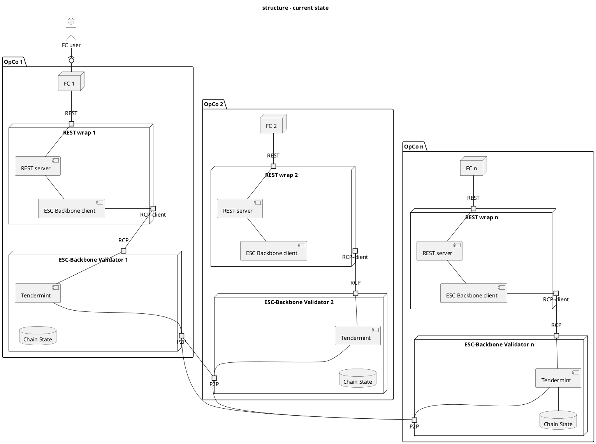
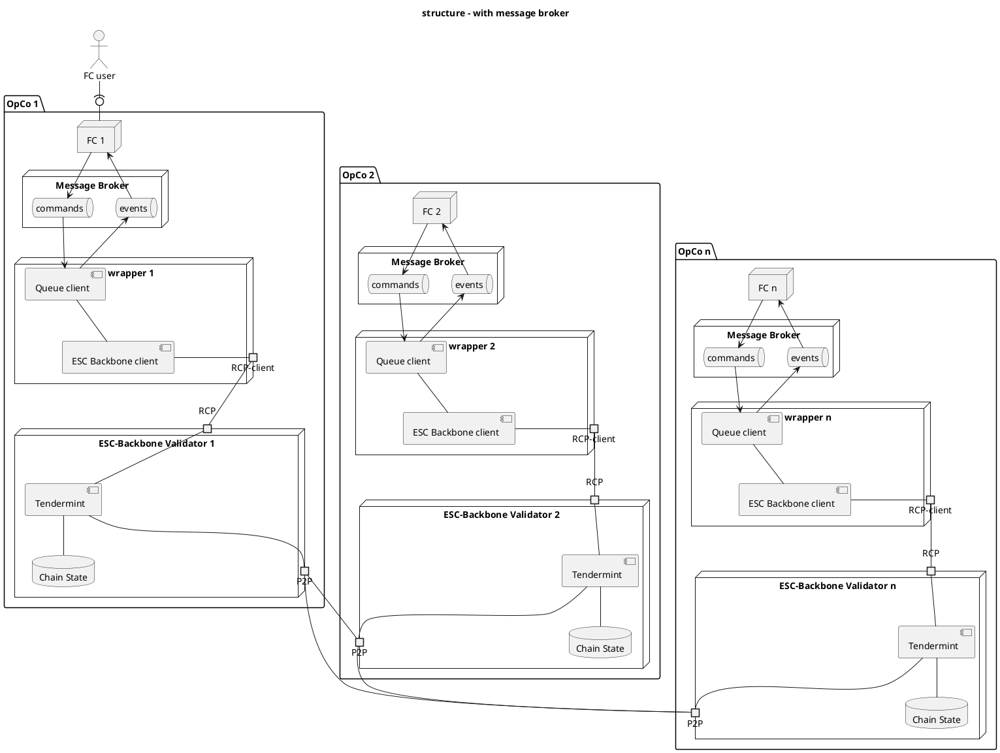
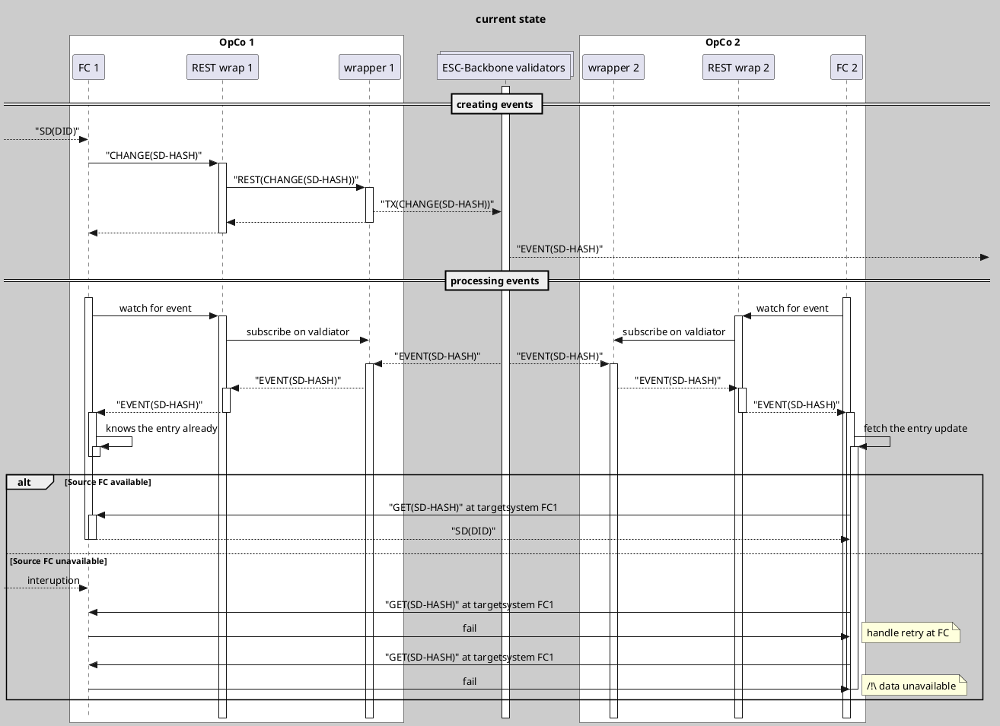
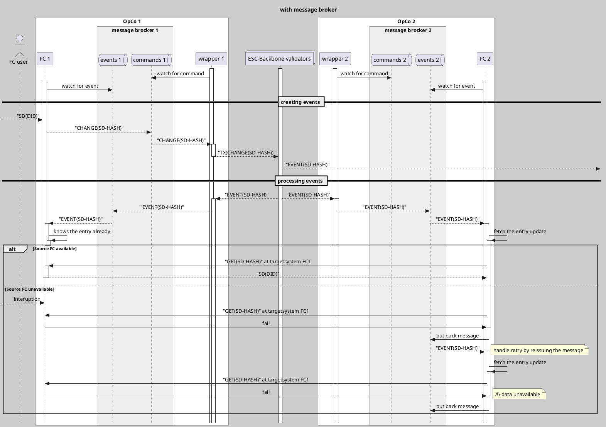

TODO
rework documentation to reflect the queue interface and drop the rest interface

## Login to ghcr.io

```shell
echo "enter your github username" && \
read USERNAME && \
echo "enter your PAT for github container registry" && \
read -s CR_PAT && \
echo $CR_PAT | docker login ghcr.io -u $USERNAME --password-stdin
```

## Setup
Download the docker-compose.yml from https://github.com/catenax-ng/product-esc-backbone-code/blob/create-rest-wrapper-for-resourcesync/web2-wrapper/build/docker-compose.yml

Afterwards execute this.
```shell
echo "Create env file."
cat <<EOF > .env
WRAPPER_IMAGE_HASH=sha-d480518
NATS_IMAGE_HASH=2.9.20-scratch
WRAPPER1_HOME=./tmp/wrapper1
WRAPPER2_HOME=./tmp/wrapper2
CONFIG=/wrapper/config/config.json
EOF

echo "Load settings from .env"
set -o allexport
source .env set
set +o allexport
mkdir -p $WRAPPER1_HOME
mkdir -p $WRAPPER2_HOME

docker compose -f docker-compose.yml up
```

## Configuration
The 1st wrapper uses `./tmp/wrapper1/config.json`
The 2nd wrapper uses `./tmp/wrapper2/config.json`

Stop the setup by pressing `CTRL-C`. Modify the configuration and restart with
`docker compose -f docker-compose.yml up`

The following parameters are supported.
### address_prefix
Addresses in COSMOS SDK chains are abbreviated with BECH32 representation.
This prefix defines to which chain the BECH32 address belongs to.

**The default is fine.**

### chain_id
This is the identifier for the COSMOS SDK chain. A necessary connection parameter.

**The default is fine.**

### from
Transactions issued by the wrapper are signed with a key named like the value of this parameter.
The [build/docker-compose.yml](build/docker-compose.yml) sets this value with the help of the [build/init.sh](build/init.sh). 

### host_address
Not used at the moment. This parameter was used for the REST endpoint to listen at.

### node_address
Host and port of the COSMOS SDK node to connect the wrapper too.
Use the validator2 of the testnet.

**The default is fine.**
### fees
This is the amount the wrapper is willing to pay per transaction. 

**The default is fine.**
### gas
This is the amount of gas expected to be used per transaction. 

**The default is fine.**
### home
The home folder for the COSMOS_SDK configuration.
The [build/docker-compose.yml](build/docker-compose.yml) sets this value with the help of the [build/init.sh](build/init.sh).
### key_ring_backend
With this parameter can the type of key storage system be configured.
The docker image only supports `test`.

**The default is fine.**
### start_block
This parameter controls at which block height the wrapper starts to look for resource sync events.
By default [build/docker-compose.yml](build/docker-compose.yml) sets this value to the current height when initializing with [build/init.sh](build/init.sh)

You can update this value to the current height with the following commands:
```shell

set -o allexport
source .env set
set +o allexport
HEIGHT=$(docker exec wrapper1 /wrapper/esc-backboned  status --node https://validator2-tdmt-rpc.dev.demo.catena-x.net:443/ --home /wrapper/config | jq ".SyncInfo.latest_block_height" -r)
docker compose -f docker-compose.yml down
echo $(jq "setpath(path(.start_block);$HEIGHT)" $WRAPPER1_HOME/config.json) > $WRAPPER1_HOME/config.json 
echo $(jq "setpath(path(.start_block);$HEIGHT)" $WRAPPER2_HOME/config.json) > $WRAPPER2_HOME/config.json
docker compose -f docker-compose.yml up
```

### log_level
Set the verbosity of the wrapper.
Effective values: `DEBUG`,`INFO`, `ERROR`
### broker
This block contains settings relevant to NATS.
#### broker.url
Host and port of the NATS broker.
The [build/docker-compose.yml](build/docker-compose.yml) sets this value with the help of the [build/init.sh](build/init.sh).

**The default is fine.**

#### broker.clientname
The name the wrapper uses to connect to the NATS broker, no actual meaning for the wrapper.
Change this, if the name collides with the name of your app.

#### broker.topic
The name of the topic your app wants to interact with. This topic is used by the wrapper to receive and send resource updates.


## Using the setup
There are now two NATS brokers running.
First is listening at localhost:4222, second at localhost:4223.

## Generate openapi.json
This is outdated, because no REST Endpoint is provided currently.
```shell
docker run --rm -it  --user $(id -u):$(id -g) -e GOPATH=$(go env GOPATH) -v $HOME:$HOME -v $(go env GOCACHE):/.cache/go-build -w $(pwd) --entrypoint=/bin/sh quay.io/goswagger/swagger 
SWAGGER_GENERATE_EXTENSION=false swagger generate spec -m -c cmd/rest-wrapper/ -o cmd/rest-wrapper/openapi.json 
```

# Input
```
Hi Lars,
We’ve discussed the possible reliability issues with current synch solution:

- What should FC do when SD event happens, but Synch service is not available (it’s down or some network issue)
- What should Synch service do when it got SD event, but subscribed FC instance is not available (it’s down or some network issue)

To address them we’ll need a kind of reliable message broker solution supporting durable subscriptions. But then we’ll not need to communicate with Synch service via REST API at all.
Let’s agree on how will we resolve it.
```


# For discussion

## Structure




## Creating and processing change events

### current approach


### with message broker (not implemented)
same issus, if the `targetSystem` of the event is unavailable a sync is not possible.
